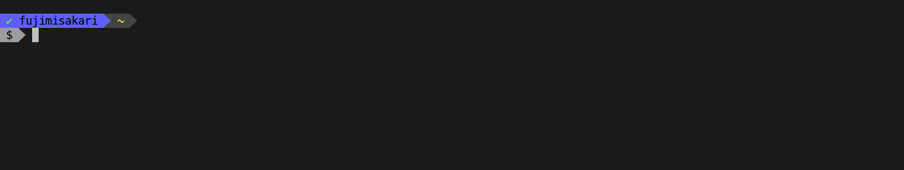

#  gdic

Go Docker Incremental CLI


## Overview

gdic is a tool that can select and execute the docker command via peco.
It is unnecessary to input the docker command, ContainerID, ImangeID, and once you start it you can operate the command continuously so you can work more efficiently.


## Screenshot

- case of `docker rm`




- case of `docker exec`


## Features

- The following Docker commands will be able to start with peco.
  - `docker exec`
  - `docker run`
  - `docker stop`
  - `docker rm`
  - `docker rmi`
- In the case of `stop`, `rm`,`rmi`, it can be selected consecutively unless you invoke the command and` exit`.
- In the case of `run`,  `exec`, execution commands can be generated with the selected container name.
- You can check the error message on peco even if `rm`, `rmi` command fails


## Installation

Install peco and go get gdic, so I don’t provide binary.

```
# For mac user
$ brew install peco

# For linux user
Download binary from https://github.com/peco/peco/releases and set to exec bin path.

$ go get -u github.com/fujimisakari/gdic
```

## Usage

When changing the Docker command to gdic and executing it, the candidate related to the command is started with peco.

```sh
$ gdic exec
$ gdic run
$ gdic stop
$ gdic rm
$ gdic rmi
```

Also, as you like, I added the following to Shell setting (zsh).

```sh
# alias
alias dstop='gdic stop'
alias drm='gdic rm'
alias drmi='gdic rmi'

# docker run by gdic
function peco-docker-run () {
   BUFFER=$(gdic run)
   CURSOR=$#BUFFER
   zle clear-screen
}
zle -N peco-docker-run
bindkey '^Xr' peco-docker-run

# docker exec by gdic
function peco-docker-exec () {
   BUFFER=$(gdic exec)
   CURSOR=$#BUFFER
   zle clear-screen
}
zle -N peco-docker-exec
bindkey '^Xe' peco-docker-exec
```

## License
The MIT License.

## Author
fujimisakari <fujimisakari@gmail.com>
